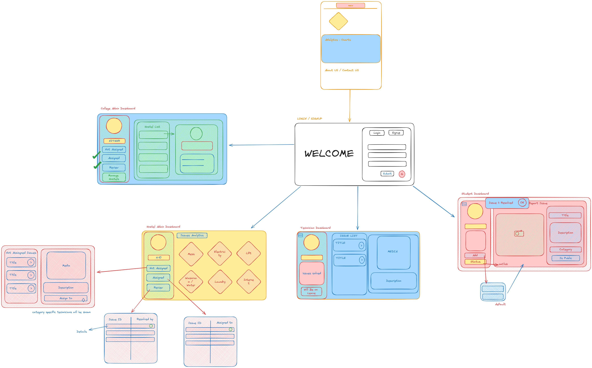

# Status-200-Excalibur
## Sitemap

### College Issue Resolution Platform
College Issue Resolution Platform aims to address the challenges faced by students residing in hostels within educational institutes. Often, students encounter various problems related to infrastructure, utilities, and miscellaneous issues within their hostel premises. The lack of a streamlined system for reporting and resolving these problems can lead to inefficiencies and delays in addressing students’ concerns.

Solution
Our solution addresses the pressing need for a streamlined and efficient system to manage hostel-related issues within educational institutes. The Hostel Issue Resolution Platform provides a user-friendly interface for students to report various problems they encounter in their hostels, categorized under sections like Internet, Electricity, Carpentry, and Miscellaneous. But that’s not all! We’ve also incorporated several add-ons to enhance the platform:
User Workflow
1. Registration: Institutes register on the platform and receive dedicated admin panels.
2. Student Registration: Students register using their institute-issued credentials.
3. Issue Reporting: Students log in and submit hostel-related issues through the user dashboard.
4. Task Assignment: Hostel administrators receive real-time notifications about new issues and assign tasks.
5. Status Tracking: Students track the status of their reported issues.
6. Continuous Improvement: Admins use feedback for ongoing enhancements.
7. User-Friendly Interface: The platform ensures an intuitive experience with clear navigation.
8. General College Issues Integration:
Extend the platform beyond hostels.
Allow students and faculty to report issues related to classrooms, laboratories, libraries, and campus facilities.
9. Institute-wide Dashboard:
Develop an overarching dashboard for institute-level administrators.
Provide a holistic view of all reported issues across hostels and general college areas.
10. Multi-College Support:
Enable the platform to seamlessly support multiple colleges.
Institutes can register, and each institute can have multiple affiliated colleges.
11. Customizable Issue Categories:
Allow colleges to define specific issue categories based on their unique infrastructure and facilities.
Accommodate diverse needs across different colleges.
12. Unified Analytics Dashboard:
Create an analytics dashboard offering insights into common issues.
Facilitate data-driven decision-making for institute-level improvements.
13. Centralized Communication Hub:
Establish a communication hub for seamless collaboration among administrators and staff.
Enhance communication channels for effective issue resolution.
14. Brand Customization:
Let institutes and colleges customize the platform with their branding elements.
Enhance the sense of ownership and identity for each participating department or hostel.
15. Feedback and Improvement:
Implement a feedback system for continuous improvement.
Enable users to provide insights on issue resolution processes and overall facilities.

Tech Stack
Frontend:
React
TypeScript
Backend:
Node.js
Express.js
Database:
PostgreSQL
Prisma (ORM)

Contributors
Darshpreet: Design
Debatreya: Frontend
Mayank: Backend
Sanyam: Backend

Installation
Clone this repository.
Install dependencies using npm install.
Set up your database and configure environment variables.
Run the application using npm start.

Contributing
We welcome contributions! Please follow our contributing guidelines.

License
This project is licensed under the MIT License.
